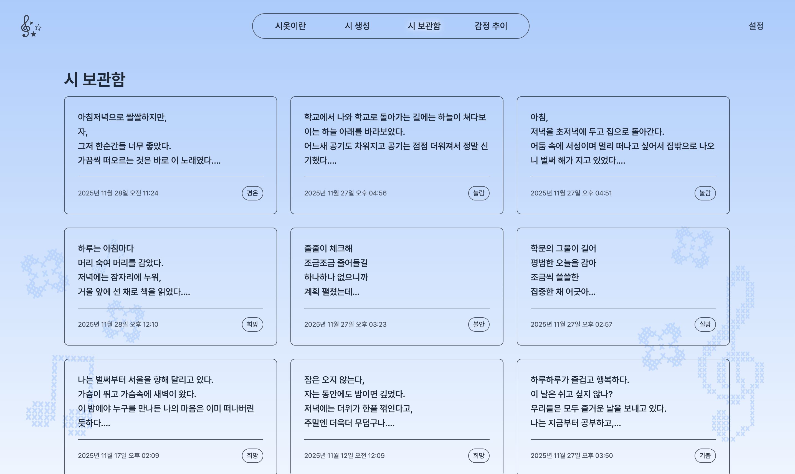
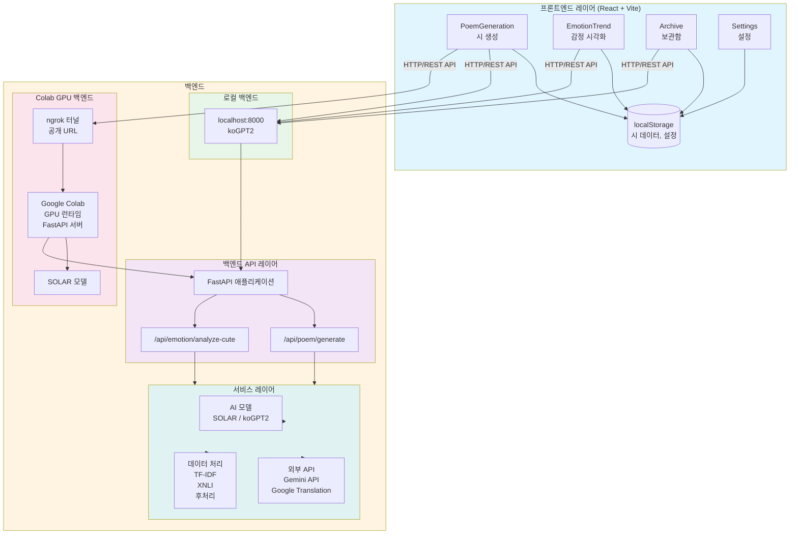

#  시옷 (SIOT) - 일기를 시로 변환하는 웹 애플리케이션
︶⊹︶︶୨୧︶︶⊹︶︶⊹︶︶୨୧︶︶⊹︶︶⊹︶︶୨୧︶︶⊹︶︶⊹︶⊹︶︶୨୧︶︶⊹︶︶⊹︶︶୨୧︶︶⊹︶︶⊹︶︶୨୧︶︶⊹︶︶  
⡤⠒⢤⡀⠀⠀⠀⠀⠀⠀⠀⠀⠀⠀⠀⠀⠀⠀⢀⡤⠒⢤   
⢣⡀⠀⠉⠲⢤⣀⡀⠀⠀⠀⠀⠀⠀⢀⣀⡤⠖⠉⠀⢀⡜   
⢸⡉⠒⠄⠀⠀⠀⢉⡙⢢⠀⠀⡔⢋⡉⠀⠀⠀⠠⠒⢉⡇   
⠀⠉⢖⠒⠀⠀⠀⣇⠀⣸⠀⠀⣇⠀⣸⠀⠀⠀⠒⡲⠉   
⠀⠀⠀⠀⠉⠙⠫⠤⠚⠉⠀⠀⠀⠀⠉⠓⠤⠝⠋⠉   
︶⊹︶︶୨୧︶︶⊹︶︶⊹︶︶୨୧︶︶⊹︶︶⊹︶︶୨୧︶︶⊹︶︶⊹︶⊹︶︶୨୧︶︶⊹︶︶⊹︶︶୨୧︶︶⊹︶︶⊹︶︶୨୧︶︶⊹︶︶

**AI 기반 한국어 시 생성 플랫폼**  
일상의 일기나 텍스트를 입력하면, TF-IDF로 핵심 키워드를 추출하고 XNLI 기반 제로샷 분류로 감정을 분석한 뒤, SOLAR-10.7B-Instruct 또는 파인튜닝된 koGPT2 모델을 활용하여 감정과 키워드를 반영한 고품질의 한국어 시를 생성합니다.

---

## ☆ 목차

- [☆ 프로젝트 소개](#-프로젝트-소개)
- [☆ 기능](#-기능)
- [☆ 시연 과정](#-시연-과정)
- [☆ 기술적 특징](#기술적-특징)
- [☆ 데이터 흐름](#데이터-흐름)
- [☆ 시 생성 파이프라인](#시-생성-파이프라인)
- [☆ 프론트엔드 사용 흐름](#-프론트엔드-사용-흐름)
- [☆ 데이터 시각화](#데이터-시각화)
- [☆ Colab 학습 파이프라인 상세](#colab-학습-파이프라인-상세)
- [☆ 모델 심화 비교 (SOLAR vs 파인튜닝 koGPT2)](#모델-심화-비교-solar-vs-파인튜닝-kogpt2)
- [☆ 프로젝트 구조](#-프로젝트-구조)
- [☆ 아키텍처](#-아키텍처)
- [☆ 기술 스택](#-기술-스택)
- [☆ 설치 및 설정](#-설치-및-설정)
- [☆ 사용 모델 상세](#사용-모델-상세)
- [☆ 모델 비교 및 선택 가이드](#모델-비교-및-선택-가이드)
- [☆ 실행 방법](#-실행-방법)
- [☆ API 문서](#api-문서)
- [☆ 아쉬운 점](#아쉬운-점)
- [☆ 라이선스](#-라이선스)
- [☆ 추가 자료](#-추가-자료)
- [☆ 기여 가이드](#-기여-가이드)
- [☆ 감사의 말](#-감사의-말)

---

## ☆ 프로젝트 소개

### 시연 동영상

[](https://youtu.be/W_Baoamlg1E)

### 프로젝트 개요

시옷(SIOT)은 사용자의 일기를 분석하여 감성을 담은 한국어 시로 변환하는 AI 기반 웹 애플리케이션입니다. 일상의 기록, 감정, 생각을 시로 표현하고 싶지만 시 창작에 어려움을 느끼는 사람들을 위해 개발되었으며, 최신 AI 기술을 활용해 누구나 쉽게 자신만의 시를 생성할 수 있도록 돕습니다.

### 프로젝트 배경 및 목적

#### 시옷을 만들게 된 이유

일상에서 일기나 메모를 쓰다 보면, 시간이 지나 다시 읽어봤을 때 그때의 감정이 제대로 전달되지 않는 아쉬움이 있습니다. 이러한 일상의 기록들을 **시**로 변환하면 어떨까 하는 생각에서 시작했습니다. 시는 감정을 압축하고, 핵심만 남기며, 시간이 지나도 그 느낌을 간직할 수 있기 때문입니다.

하지만 시를 직접 써보려고 하면 막막한 경우가 많습니다. 감정은 있지만 어떻게 표현해야 할지 모르겠고, 운율이나 형식 같은 것도 부담스럽습니다. 그래서 AI를 활용하여 누구나 쉽게 시를 만들어볼 수 있는 도구를 만들고자 했습니다. 복잡한 설정 없이, 오늘 하루 있었던 일을 적으면 시가 나오는 그런 경험을 제공하고 싶었습니다.

시옷은 이런 고민에서 시작했습니다. 일상의 기록을 더 의미 있게 보존하고 싶은 사람들, 시를 쓰고 싶지만 어려워하는 사람들을 위한 도구가 되고자 합니다.

#### 핵심 가치

**☘︎ 가벼운 시작**  
긴 글을 쓸 필요가 없습니다. 오늘 점심에 무엇을 먹었는지, 날씨가 어땠는지 같은 작은 일상 몇 줄만 적어도 시가 생성됩니다. 일기처럼 생각나는 대로 적으면 되므로 부담이 적습니다.

**☘︎ 내 목소리 그대로**  
같은 내용이라도 SOLAR로 만들면 더 함축적인 느낌이 나고, koGPT2로 만들면 더 현대적인 느낌이 납니다. 누구에게 보여줄지, 어떤 톤으로 남길지에 따라 선택하면 됩니다.

**☘︎ 기억 정리와 보관**  
산문으로 흩어져 있던 감정들을 시로 압축해두면, 나중에 다시 읽어봤을 때 그때의 핵심만 남아있습니다. 표현도 다듬어지므로 더 깔끔하게 보관할 수 있습니다.

**☘︎ 감정 들여다보기**  
생성된 시마다 감정 분석 결과가 함께 제공됩니다. 이를 차트로 모아보면 며칠간의 감정 변화를 한눈에 확인할 수 있습니다. 가끔 "이번 주에는 슬픈 시를 많이 만들었구나" 같은 패턴을 발견하기도 합니다.

**☘︎ 창작 연습 파트너**  
시를 쓰고 싶은데 아이디어가 막힐 때도 활용할 수 있습니다. 키워드나 분위기만 지정하여 초안을 받아보고, 거기서 시작해서 고쳐나가면 됩니다.

## ☆ 기능

- 일상글에서 핵심 키워드 추출 (TF-IDF)
- 감정 분석 및 분위기 매핑 (XNLI 제로샷)
- AI 기반 한국어 시 생성
  - **SOLAR-10.7B-Instruct** (GPU 권장, 고품질)
  - **koGPT2 파인튜닝 모델** (CPU 친화적, KPoEM 데이터셋 학습)
- 비한국어 자동 번역 (Google Cloud Translation API)
- 감정 추이 시각화
  - 최근 7일 감정 추이, 감정 분포, 신뢰도 분포 등
- 모델 학습 및 평가
  - k-fold 교차 검증, Google Colab GPU 활용 학습, 학습 모델 자동 로드
- Gemini API 기반 감정 분석 후처리
  - 감정 데이터를 사용자 친화적인 스토리로 변환

## ☆ 시연 과정

### 1. 시작 및 화면 소개

시옷은 일기를 시로 변환하는 웹 애플리케이션입니다. 메인 화면인 PoemGeneration 페이지에서는 상단에 SOLAR와 koGPT2 두 가지 모델을 선택할 수 있는 버튼이 있고, 아래에는 일상을 입력할 수 있는 텍스트 영역이 있습니다.


### 2. 입력 및 모델 선택

오늘 하루 있었던 일을 간단히 적어봅니다. 입력이 비어있으면 버튼이 비활성화되어 입력 검증이 이루어집니다. SOLAR 모델은 GPU 환경에서 더 고품질의 시를 생성하는 모델이고, koGPT2는 CPU 환경에서 사용할 수 있는 모델입니다.


### 3. 시 생성 과정

"시 생성하기" 버튼을 클릭하면 로딩 애니메이션이 나타나고 "시 생성 중..."이라는 메시지가 표시됩니다.

백엔드에서는 입력된 텍스트를 분석하여 키워드를 추출하고, 감정을 분류한 다음, AI 모델이 시를 생성합니다. 추출된 키워드와 분류된 감정은 시 생성 프롬프트에 포함되어 최종 시의 내용과 분위기에 반영됩니다.

**SOLAR 모델 사용 시:**


**학습된 koGPT2 모델 사용 시:**


### 4. 시 생성 예시

다음은 실제 일상글을 입력하여 시를 생성한 예시입니다. 이 예시는 **koGPT2 모델**을 사용하여 생성되었습니다.

```
원본 일상글:
오늘 저녁은 우동을 먹었다. 우동은 정말 맛있는 것 같다. 다음에는 유부초밥도 같이 먹어야겠다.

생성된 시 (koGPT2 모델):
가을날씨가 너무 좋구나.
오늘 하루가 이렇게 좋은 날이었으면 좋겠어.
우동 먹고 싶어서 그랬던 거야. 그래서 그런지 요즘에는 왠지 마음이 편해졌어!
유부 초밥을 좋아해서 그러는 건데, 그게 아니라면, 유부는 언제나 맛있잖아.
```

다음은 **SOLAR 모델**을 사용하여 생성한 예시입니다.

```
원본 일상글:
오늘은 머릿속이 온통 '앞일' 생각으로 가득했다. 해야 할 것과 잘해야만 할 것들이 줄줄이 떠오르면서, 가만히 있어도 마음이 바빠지는 느낌이었다. 계획을 세워 보려고 노트를 펼쳤는데, 글자보다 걱정이 먼저 적히는 것 같았다. 그렇다고 멈출 수는 없으니까, 아주 작은 일부터 하나씩 체크해 나가 보기로 했다. 불안이 완전히 사라지진 않겠지만, 그래도 조금씩 줄어들길 바라고 있다.

생성된 시 (SOLAR 모델):
줄줄이 체크해
조금조금 줄어들길
하나하나 없으니까
계획 펼쳤는데
불안한 마음
바람에 서리처
끝없은 미로
어디로 향하나
```

### 5. 결과 확인

시가 생성되면 화면에 여러 정보가 카드 형태로 표시됩니다. 생성된 시 본문이 가장 위에 표시되고, 그 아래에는 감정 분석 결과가 나타납니다. 추출된 키워드들도 함께 보여지며, 각 키워드는 시 생성 시 프롬프트에 포함되어 시의 내용에 반영됩니다. 이 시는 자동으로 브라우저의 localStorage에 저장되며, 필요하면 "보관함에 저장" 버튼을 눌러 수동으로도 저장할 수 있습니다.

**SOLAR 모델 결과:**


**학습된 koGPT2 모델 결과:**


### 6. 보관함

Archive 페이지에서는 지금까지 생성하고 저장한 모든 시를 시간순으로 볼 수 있습니다. 생성된 시를 수정하거나 삭제할 수 있습니다.




### 7. 감정 추이 시각화

상단 메뉴에서 EmotionTrend 페이지로 이동하면 생성한 시들의 감정 데이터를 시각화하여 볼 수 있습니다. 최근 7일 감정 추이, 감정 분포, 감정 신뢰도 분포 등 다양한 차트를 통해 시간에 따른 감정 변화를 한눈에 확인할 수 있습니다.


### 8. 설정

Settings 페이지에서는 기본 모델 선택, 자동 저장 기능, 데이터 관리 등의 설정을 변경할 수 있습니다. 기본 모델을 선택하면 다음 시 생성 시 자동으로 해당 모델이 선택되며, 자동 저장 기능을 활성화하면 시 생성 시 자동으로 보관함에 저장됩니다.

또한 설정에서 생성된 시를 JSON 파일로 내보낼 수 있습니다. 이 JSON 파일에는 원본 일상글, 생성된 시, 키워드, 감정 정보 등이 포함되어 있어, 나중에 이 데이터를 활용하여 나만의 시 생성 모델을 학습할 수 있습니다.


## ☆ 기술적 특징

### 하이브리드 AI 접근

- **시 생성**: SOLAR, koGPT2  
- **감정 분류**: 제로샷 감정 분석 (XNLI)  
- **키워드 추출**: TF-IDF  
- **후처리**: Gemini API  
- **번역**: Google Cloud Translation

## ☆ 데이터 흐름

1. **사용자 입력** → 프론트엔드에서 일상글 입력  
2. **키워드 추출** → TF-IDF로 핵심 키워드 추출  
3. **감정 분석** → XNLI 기반 제로샷 감정 분류  
4. **프롬프트 구성** → 키워드, 감정, 옵션을 조합해 프롬프트 생성  
5. **시 생성** → SOLAR/koGPT2 모델로 생성   
6. **번역** → 비한국어 시는 한국어로 자동 번역  
7. **결과 반환** → 시/메타데이터를 프론트엔드로 전달

## ☆ 시 생성 파이프라인

시옷은 다음과 같은 단계로 일상글을 시로 변환합니다:

### 1. 프론트엔드 입력 (`PoemGeneration.jsx`)
- **모델 선택**: 사용자가 SOLAR(GPU) 또는 koGPT2(CPU) 모델을 선택합니다. SOLAR 선택 시 ngrok URL이 유효한지 검증합니다.
- **API 호출**: AbortController를 사용하여  `/api/poem/generate` 엔드포인트로 POST 요청을 전송합니다.

### 2. FastAPI 진입 (`app/main.py`)
- **요청 검증**: Pydantic 모델을 사용하여 요청 본문의 형식을 검증하고, 입력 텍스트가 비어있지 않은지, 길이가 적절한지 확인합니다.
- **서비스 호출**: 검증 통과 시 `generate_poem_from_text()` 함수를 호출합니다.

### 3. 메타데이터 추출
- **키워드 추출** (`keyword_extractor.py`): TF-IDF 알고리즘과 형태소 분석을 통해 핵심 키워드를 추출합니다. 입력 텍스트를 문장/문단 단위로 분할하여 여러 소문서로 나누고, 특정 단어가 해당 문서에서는 자주 나타나지만 다른 문서에서는 드물게 나타날수록 높은 점수를 부여합니다. 한국어 조사를 자동으로 제거하고, 2글자 이상의 의미 있는 단어만 추출합니다. 의미적으로 유사하거나 중복되는 키워드를 제거하여 최종적으로 상위 10개의 핵심 키워드를 선별합니다.
- **감정 분석** (`emotion_classifier.py`): XLM-RoBERTa-large-XNLI 모델을 사용하여 13가지 감정 중 하나를 분류하고 신뢰도 점수를 계산합니다. 감정 레이블을 시의 분위기로 자동 변환합니다.
  - **감정 라벨 (13가지)**: 기쁨, 슬픔, 분노, 놀람, 두려움, 혐오, 사랑, 그리움, 평온, 불안, 희망, 실망, 중립
  - **감정 → 분위기 매핑**: 분류된 감정은 자동으로 분위기로 변환되어 시 생성 프롬프트에 포함됩니다 (예: 기쁨 → "밝은", 슬픔 → "쓸쓸한", 사랑 → "따뜻한").
  - 각 감정에 대한 신뢰도 점수를 제공하며, 가장 높은 점수를 받은 감정이 최종 분류 결과가 됩니다.
- **프롬프트 구성** (`poem_prompt_builder.py`): SOLAR는 chat template 형식, koGPT2는 단순 텍스트 프롬프트 형식으로 구성합니다. 추출된 키워드와 분위기를 프롬프트에 포함시켜 시의 내용과 톤을 제어합니다.

### 4. 모델 로딩 (`poem_model_loader.py`)
- **환경 감지**: GPU 사용 가능 여부를 자동으로 감지합니다. `POEM_MODEL_TYPE` 환경 변수와 GPU 여부에 따라 SOLAR 또는 koGPT2를 선택합니다.
- **모델 로딩**: SOLAR는 4-bit NF4 양자화를 적용하여 GPU 메모리를 절약합니다. koGPT2는 CPU 환경에서도 실행 가능하며, `trained_models/` 폴더에 파인튜닝된 모델이 있으면 자동으로 로드합니다.

### 5. 시 생성 (`poem_generator.py`)
- **토크나이즈**: 프롬프트를 모델의 토크나이저로 인코딩합니다.
- **생성 파라미터**: `temperature=0.7`, `top_p=0.9`, `do_sample=True`를 설정합니다. `max_new_tokens`는 GPU 환경에서는 최대 80, CPU 환경에서는 최대 40으로 제한합니다.
- **모델 추론**: `model.generate()`를 호출하여 시를 생성합니다. 생성된 토큰을 디코딩하여 텍스트로 변환하며, 입력 프롬프트 부분은 제외하고 새로 생성된 부분만 추출합니다.

### 6. 텍스트 후처리 (`poem_text_processor.py`)
- **깨진 문자 제거**: 인코딩 오류로 인한 깨진 문자를 제거합니다.
- **프롬프트 잔여 텍스트 제거**: 지시어 패턴(`시:`, `Answer:`, `Output:` 등), chat template 패턴(`<|assistant|>`, `<|user|>` 등), 번역 주석 패턴(`(번역: ...)`, `[번역: ...]` 등)을 정규표현식으로 제거합니다.
- **산문/비시적 패턴 필터링**: 해시태그, URL, 방송사명, 수식, 의미 없는 대문자 단어 조합 등을 제거합니다.
- **줄 수 조정**: 공백 줄을 제거하고 기본 4~12줄로 줄 수를 제한합니다. 후처리 결과가 비어있으면 원문을 반환하여 최소한의 텍스트는 보장합니다.

### 7. 번역 처리 (`translator.py`)
- **언어 감지**: 각 줄을 순회하며 비한국어 문자가 포함되어 있는지 확인합니다. 허용 문자는 한글, 자모, 숫자, 기본 문장부호, 공백입니다.
- **줄 단위 번역**: 비한국어가 포함된 줄만 Google Cloud Translation API를 호출합니다.
- **한국어 강제 정리**: 번역 결과에서 한자, 영어, 기타 문자를 제거하고 한글만 남깁니다. 자주 사용되는 한자는 의미를 살려 한글로 변환합니다.

### 8. 응답 조립 (`app/main.py`)
- **JSON 응답**: 생성된 시, 키워드, 감정 레이블, 감정 신뢰도, 성공 여부 등을 JSON 형식으로 구성합니다. 옵션에 따라 Gemini 기반 감정 스토리를 생성하여 함께 반환할 수 있습니다.

### 9. 프론트엔드 후처리 (`PoemGeneration.jsx`)
- **결과 표시**: 생성된 시, 키워드, 감정 분석 결과를 카드 형태로 화면에 표시합니다.
- **자동 저장**: `localStorage`의 `saved_poems` 배열에 자동으로 저장합니다(설정에서 비활성화 가능). "보관함에 저장" 버튼을 통해 수동으로도 저장할 수 있습니다.
- **데이터 재사용**: EmotionTrend 페이지에서 감정 추이 시각화, Archive 페이지에서 저장된 시 목록으로 활용됩니다.

## ☆ 프론트엔드 사용 흐름

### PoemGeneration 페이지
- **입력 영역**: "일상글을 입력해주세요" 텍스트 영역에 하루 기록이나 감정을 작성합니다. 공백만 있으면 제출 버튼이 비활성화됩니다.
- **모델 선택**: 상단 버튼으로 SOLAR(GPU) 또는 koGPT2(CPU)를 명시적으로 선택할 수 있습니다. 선택하지 않으면 환경 변수에 따라 자동 결정되지만, SOLAR를 강제하려면 ngrok/Colab URL 검증을 통과해야 합니다.
- **결과 출력/자동 저장**:
  - 성공 시 키워드·감정·시 본문을 카드로 보여주고, localStorage(`saved_poems`)에 자동 저장합니다(설정에서 끌 수도 있음).
  - "보관함에 저장" 버튼으로 수동 저장도 가능합니다.

### EmotionTrend / Archive / Settings
- **EmotionTrend**: localStorage 데이터를 이용해 최근 7일 감정 추이, 전체 감정 분포, 감정 신뢰도 분포를 Recharts로 시각화합니다. 데이터가 없으면 차트를 숨기고 안내 문구를 표시합니다.
- **Archive**: 저장된 시 목록을 시간순으로 나열하고, 복사·삭제 기능을 제공합니다.
- **Settings**: 기본 모델 타입, 자동 저장 여부 등을 `app_settings`에 저장해 다음 실행 시 유지합니다.

## ☆ 데이터 시각화

### 구현된 시각화

#### 1. 최근 7일 감정 추이 (라인 차트)

**데이터 소스**: localStorage에 저장된 최근 7일 시 생성 기록

**특징:**
- 상위 5개 감정만 선별하여 표시하여 가독성 향상
- 날짜별로 감정별 시 생성 개수를 집계
- 마우스 호버 시 해당 날짜의 각 감정별 정확한 개수를 툴팁으로 표시
- 각 감정마다 고유한 색상 할당

**활용**: 일주일간의 감정 변화 패턴을 한눈에 파악할 수 있습니다.

#### 2. 감정 분포 (파이 차트)

**데이터 범위**: 전체 기간의 모든 시 생성 기록

**특징:**
- 각 감정이 전체 중 차지하는 비율을 원형으로 표현
- 각 감정의 절대 개수도 함께 표시
- 개수가 많은 순서대로 정렬하여 주요 감정을 쉽게 파악

**활용**: 전체 기간 동안 어떤 감정의 시를 가장 많이 생성했는지 비율로 확인할 수 있습니다.

#### 3. 감정 신뢰도 분포 (바 차트)

**데이터**: 각 시 생성 시 감정 분석의 신뢰도 점수

**특징:**
- 신뢰도를 5개 구간으로 분류 (매우 낮음: 0.0~0.2, 낮음: 0.2~0.4, 보통: 0.4~0.6, 높음: 0.6~0.8, 매우 높음: 0.8~1.0)
- 감정 분석의 전반적인 신뢰도 수준 파악
- 낮은 신뢰도가 많으면 입력 텍스트나 분석 모델 개선 필요성을 확인

**활용**: 감정 분석의 정확도를 평가하고, 신뢰도가 낮은 시 생성 기록을 확인할 수 있습니다.

#### 4. 전체 기간 감정 추이 (라인 차트)

**데이터 범위**: 모든 시 생성 기록  
**시간 단위**: 주 단위 집계

**특징:**
- 일별 데이터를 주 단위로 그룹화하여 장기 트렌드 확인
- 가장 많이 나타난 감정 8개만 표시하여 복잡도 관리
- 주 라벨이 길 경우 45도 회전하여 가독성 향상

**활용**: 계절별 감정 변화 패턴이나 장기적인 감정 트렌드를 파악할 수 있습니다.

### 데이터 저장 및 관리

- **localStorage 기반**: 모든 시 생성 기록이 브라우저 로컬 스토리지에 저장됩니다.
- **자동 저장**: 시 생성 시 자동으로 저장되며, 설정에서 끌 수 있습니다.
- **데이터 구조**: 각 시는 시 텍스트, 감정 라벨, 감정 신뢰도, 키워드, 생성 시간 등의 정보를 포함합니다.


## ☆ Colab 학습 파이프라인 상세

`train_koGPT2.ipynb` 파일을 Google Colab에서 불러오고 실행하면 모델을 학습시킬 수 있습니다. 학습이 완료되면 모델을 다운로드하여 `backend/trained_models/` 폴더에 배치하면 자동으로 로드됩니다.

### 학습 데이터셋

**KPoEM (Korean Poem Dataset)**
- **소스**: Hugging Face `AKS-DHLAB/KPoEM`
- **형식**: TSV 파일 (`KPoEM_poem_dataset_v4.tsv`)
- **내용**: 한국어 시 데이터셋으로, 시 원문 텍스트를 포함
- **사용량**: 학습 시 최대 100개 샘플 사용 (전체 데이터셋 사용 가능, `MAX_DATA_SIZE` 파라미터로 조절)

**사용자 데이터 활용**
- Settings 페이지에서 생성된 시를 JSON 파일로 내보낼 수 있습니다
- 이 JSON 파일에는 원본 일상글과 생성된 시가 쌍으로 저장되어 있어, 커스텀 학습 데이터셋으로 활용 가능합니다
- 자신이 생성한 시 데이터를 모아서 `train_kogpt2_colab.py` 스크립트에 적용하면, 자신만의 스타일을 반영한 시 생성 모델을 만들 수 있습니다

### 학습 설정 및 하이퍼파라미터

**기본 모델**: `skt/kogpt2-base-v2` (124M 파라미터)

**학습 방법**: k-fold 교차 검증 (5-fold)

**학습 전략**:
1. **시 원문 학습**: 시 텍스트만으로 학습하여 시의 형식, 구조, 표현 방식을 학습
2. **산문 → 시 변환 학습**: 산문을 시로 변환하는 패턴을 학습하여 일상글을 시로 변환하는 능력 향상

### 학습 과정

1. **데이터 준비** – KPoEM 데이터셋을 Hugging Face에서 다운로드하고 정규화
2. **k-fold 분할** – 데이터를 5개 fold로 분할
3. **fold별 학습** – 각 fold마다 토크나이저 준비, 데이터셋 전처리, `Trainer` API로 학습 실행, validation 평가, checkpoint 저장
4. **평가 및 선별** – 각 fold 모델의 성능을 평가하여 최적 fold 선정
5. **배포 준비** – 선택된 fold 모델을 로컬 `backend/trained_models/`에 복사하여 자동 로드

### 학습 결과

**학습 완료 모델**:
- 각 fold마다 독립적인 모델이 생성되어 `fold_1`, `fold_2`, ..., `fold_5` 디렉터리에 저장
- 모델 파일은 Google Drive에 저장되며, 필요시 로컬로 다운로드

**성능 개선**:
- 기본 koGPT2 대비 시 생성 품질 향상, 한국어 시 형식에 더 적합한 표현 생성
- 줄 수, 분위기, 필수 키워드 등 사용자 옵션에 더 민감하게 반응
- CPU 환경에서도 시다운 표현을 유지하며 빠른 추론 가능

**평가 지표**:

k-fold 교차 검증에서는 학습 중과 학습 후 두 단계로 성능을 평가합니다.

- **학습 중 평가 (Validation)**: 각 fold 학습 시 validation 세트로 Perplexity(혼란도)와 토큰 손실을 계산합니다.

- **학습 후 평가 (`evaluate_folds_colab.py`)**: 각 fold 모델을 테스트 데이터로 평가합니다. 
  - **시 품질 평가**: 형식 점수(줄 개수, 줄 길이), 한국어 점수, 산문 패턴 감지, 시적 표현 보너스, 길이 점수를 가중 평균하여 0.0(산문) ~ 1.0(시) 점수 계산
  - **키워드 관련성 평가**: 추출된 키워드 중 생성된 시에 포함된 비율을 계산하여 0.0 ~ 1.0 점수 부여
  - **감정 관련성 평가**: 원본 텍스트의 감정과 생성된 시의 감정 일치도 및 감정 단어 사용 빈도를 가중 평균하여 점수 계산
  - **의미 유사도 평가 (BERTScore)**: BERT 모델을 사용하여 원본 시와 생성된 시 간의 의미적 유사도를 측정합니다. Precision, Recall, F1 점수를 계산하며, 각 점수는 0.0(완전히 다름) ~ 1.0(완전히 동일) 범위입니다. BERTScore는 단순 단어 일치가 아닌 의미적 유사도를 평가하므로, 생성된 시가 원본 시의 의미를 얼마나 잘 보존했는지 정량적으로 측정할 수 있습니다.
  - **종합 성공률**: 필수 조건(30%)과 선택 조건(70%)을 가중 평균하여 종합 점수 계산, 0.6 이상이면 성공으로 판단
  - **Classification Metrics (분류 평가 지표)**: 
    - **감정 분류 Confusion Matrix**: 원본 텍스트의 감정(밝은/어두운/잔잔한)과 생성된 시의 감정을 비교하여 혼동 행렬 생성
    - **성공/실패 분류 Confusion Matrix**: 성공/실패 예측 정확도 측정
    - **BERTScore 분포 차트**: 원본 시와 생성된 시 간의 의미적 유사도(BERTScore F1) 점수 분포를 히스토그램으로 시각화
    - **Precision, Recall, F1-Score**: 각 분류 작업에 대한 클래스별 정밀도, 재현율, F1 점수 계산
    - **Classification Report**: sklearn 형식의 상세 분류 리포트 출력
    - **시각화**: matplotlib/seaborn을 사용하여 confusion matrix와 BERTScore 분포를 히트맵/히스토그램 이미지로 저장 (각 fold별 및 전체 종합, 한글 폰트 없이도 작동하도록 영어 라벨 사용)

    다음은 Fold 2 모델의 평가 결과입니다:

    **Fold 2 모델 평가 결과:**

    <div style="display: flex; gap: 20px; flex-wrap: wrap;">
      <div style="flex: 1; min-width: 300px;">
        
        <p style="text-align: center; margin-top: 10px;">감정 분류 Confusion Matrix: 원본 텍스트의 감정(밝은/어두운/잔잔한)과 생성된 시의 감정 일치도를 측정합니다.</p>
      </div>
      <div style="flex: 1; min-width: 300px;">
        
        <p style="text-align: center; margin-top: 10px;">성공/실패 분류 Confusion Matrix: 모델이 성공적으로 시를 생성했는지 여부를 평가합니다. True는 성공, False는 실패를 의미합니다.</p>
      </div>
      <div style="flex: 1; min-width: 300px;">
        
        <p style="text-align: center; margin-top: 10px;">BERTScore F1 분포: 원본 시와 생성된 시 간의 의미적 유사도(BERTScore F1) 점수 분포를 히스토그램으로 시각화합니다. 높은 점수일수록 원본 시와 의미적으로 유사합니다.</p>
      </div>
    </div>

    **BERTScore 평가 설명:**

    BERTScore는 BERT 모델의 임베딩을 사용하여 두 텍스트 간의 의미적 유사도를 측정하는 평가 지표입니다. 단순히 단어가 일치하는지가 아니라, 문맥과 의미를 고려하여 평가합니다.

    - **BERTScore F1**: Precision과 Recall의 조화평균으로, 전체적인 의미 유사도를 나타냅니다 (0.0 ~ 1.0)
    - **BERTScore Precision**: 생성된 시의 단어들이 원본 시의 의미를 얼마나 잘 반영했는지 측정
    - **BERTScore Recall**: 원본 시의 의미가 생성된 시에 얼마나 잘 포함되었는지 측정
    - **평균/표준편차/최소/최대**: 모든 샘플에 대한 BERTScore F1 점수의 통계적 분포를 분석하여 모델의 일관성을 평가

    BERTScore가 높을수록 생성된 시가 원본 시의 의미를 더 잘 보존했다고 평가할 수 있습니다.
  - **시 품질 통계**: 
    - **평균/중앙값/표준편차**: 시 품질 점수의 통계적 분포 분석
    - **최소값/최대값**: 시 품질 점수의 범위 확인
    - **시 형태 분포**: 시로 판정된 비율, 산문/일기/설명문으로 판정된 개수 및 비율

**최적 모델 선정**:
- 각 fold의 성공률, 평균 시 품질 점수, 평균 키워드 점수, 평균 감정 점수를 종합하여 가장 높은 성능을 보인 fold를 최적 모델로 선정

**실제 사용**:
- 학습된 모델은 `backend/trained_models/` 디렉터리에 배치되면 FastAPI가 자동으로 로드
- 프론트엔드에서 "koGPT2 (CPU)" 모델 선택 시 파인튜닝된 모델이 사용되며, Temperature 0.65, Top-p 0.85, 반복 패널티 1.6 등 시 특화 하이퍼파라미터로 추론 수행

## ☆ 모델 심화 비교 (SOLAR vs 파인튜닝 koGPT2)

| 항목 | SOLAR-10.7B-Instruct | koGPT2-base-v2 (KPoEM 파인튜닝) |
|------|----------------------|--------------------------------|
| **모델 유형** | 10.7B Instruct (Upstage) | 124M 한국어 GPT2 |
| **필수 환경** | CUDA GPU | CPU 또는 GPU |
| **로딩 방식** | bitsandbytes 4bit NF4 + device_map=auto | float16/float32, `trained_models/` 캐시 |
| **표현 스타일** | 함축적, 상징적, 고전 시 느낌 | 일상 언어, 직접적 감정 묘사 |
| **장점** | 고품질, 긴 문맥, 옵션 없이도 안정적 | 가벼움, 빠른 추론, 옵션 제어 용이 |
| **단점** | 21GB 로딩, GPU 의존 | 표현 다양성 제한, 긴 문맥 취약 |
| **추천 시나리오** | 감성·고전 시, GPU 보유 | 로컬 개발, 데모, 옵션 세밀 제어 필요 시 |

프론트엔드 `PoemGeneration`은 사용자가 모델을 명시적으로 선택할 수 있고, SOLAR는 ngrok URL 검증을 통과해야 요청을 보냅니다.

> Google Cloud Translation / Gemini / ngrok 설정 요약은 [`docs/API.md`](docs/API.md)를 확인하세요.

## ☆ 프로젝트 구조

```
siot-OSS/
├── backend/                    # 백엔드 서버
│   ├── app/                    # FastAPI 애플리케이션
│   │   ├── main.py            # FastAPI 엔트리포인트
│   │   └── services/          # 핵심 비즈니스 로직
│   │       ├── poem_generator.py          # 시 생성 메인 로직
│   │       ├── poem_model_loader.py       # 모델 로딩
│   │       ├── poem_prompt_builder.py      # 프롬프트 구성
│   │       ├── poem_text_processor.py     # 후처리
│   │       ├── emotion_classifier.py      # 감정 분류
│   │       ├── keyword_extractor.py       # 키워드 추출
│   │       ├── translator.py              # 번역
│   │       └── poem_config.py            # 설정
│   ├── colab_server.py        # Colab 실행 스크립트
│   ├── train_kogpt2_colab.py  # koGPT2 k-fold 학습 스크립트
│   ├── evaluate_folds_colab.py # fold 모델 평가 스크립트
│   ├── find_model_folder.py   # 최신 모델 폴더 찾기
│   ├── requirements.txt       # Python 의존성
│   └── trained_models/        # 학습된 모델 저장소
│
├── frontend/                   # 프론트엔드 (React + Vite)
│   ├── src/
│   │   ├── pages/            # 페이지 컴포넌트
│   │   │   ├── PoemGeneration.jsx    # 시 생성 페이지
│   │   │   ├── EmotionTrend.jsx      # 감정 추이 페이지
│   │   │   ├── Archive.jsx           # 아카이브 페이지
│   │   │   ├── Settings.jsx          # 설정 페이지
│   │   │   ├── Main.jsx              # 메인 페이지
│   │   │   ├── Landing.jsx           # 랜딩 페이지
│   │   │   └── About.jsx             # 소개 페이지
│   │   ├── components/       # 재사용 가능한 컴포넌트
│   │   │   ├── Footer.jsx            # 푸터 컴포넌트
│   │   │   ├── Typewriter.jsx        # 타이핑 효과 컴포넌트
│   │   │   ├── SegmentedTypewriter.jsx  # 세그먼트 타이핑 효과
│   │   │   └── CursorStar.jsx       # 커서 별 효과 컴포넌트
│   │   ├── layouts/          # 레이아웃 컴포넌트
│   │   │   └── AppLayout.jsx         # 앱 레이아웃
│   │   ├── App.jsx           # 메인 앱 컴포넌트
│   │   ├── main.jsx          # 진입점
│   │   └── index.css         # 전역 스타일
│   ├── public/               # 공개 정적 파일
│   │   └── favicon.svg       # 파비콘
│   ├── index.html            # HTML 템플릿
│   ├── package.json          # Node.js 의존성
│   ├── vite.config.js        # Vite 설정
│   └── eslint.config.js      # ESLint 설정
│
├── docs/                      # 문서
│   └── API.md                # API 설정 가이드
│
├── GPU_backend.ipynb          # Colab GPU 백엔드 실행 노트북
├── train_koGPT2.ipynb         # koGPT2 학습 실험 노트북
│
└── README.md                 # 프로젝트 문서
```

## ☆ 아키텍처
### 전체 시스템 구조



### 배포 환경별 아키텍처

**로컬 개발 환경**:
```
프론트엔드 (localhost:5173) → 백엔드 (localhost:8000) → 로컬 모델/API
```

**Colab GPU 환경**:
```
프론트엔드 (localhost:5173) → ngrok 터널 → Colab 백엔드 (포트 8000) → GPU 모델
```

## ☆ 기술 스택

### 백엔드

#### 웹 프레임워크
| 기술 | 버전 | 용도 |
|------|------|------|
| **Python** | 3.8+ | 백엔드 언어 |
| **FastAPI** | 0.120.3 | 웹 프레임워크 |
| **Uvicorn** | 0.38.0 | ASGI 서버 |

#### AI/ML 라이브러리
| 기술 | 버전 | 용도 |
|------|------|------|
| **PyTorch** | 2.0.0+ | 딥러닝 프레임워크 |
| **Transformers** | 4.40.0+ | Hugging Face 모델 라이브러리 |
| **Accelerate** | 1.11.0+ | 분산 학습 및 추론 가속화 |
| **bitsandbytes** | - | 모델 양자화 (4-bit NF4) |
| **Safetensors** | 0.6.0+ | 안전한 모델 가중치 저장 형식 |
| **scikit-learn** | 1.3.0+ | TF-IDF 키워드 추출 |
| **NumPy** | 1.24.0+ | 수치 연산 라이브러리 |
| **sentencepiece** | 0.1.99+ | 서브워드 토크나이저 |
| **datasets** | 2.14.0+ | Hugging Face 데이터셋 로딩 |
| **protobuf** | 4.0.0+ | 프로토콜 버퍼 |

#### 외부 API
| 기술 | 버전 | 용도 |
|------|------|------|
| **google-cloud-translate** | 3.15.0+ | 번역 API |
| **google-generativeai** | 0.3.0+ | Gemini API |

### 프론트엔드

#### UI 프레임워크
| 기술 | 버전 | 용도 |
|------|------|------|
| **React** | 19.1.1 | UI 프레임워크 |
| **React Router** | 7.9.5 | 라우팅 |

#### 빌드 도구
| 기술 | 버전 | 용도 |
|------|------|------|
| **Vite** | 7.1.7 | 번들러/개발 서버 |

#### 시각화 및 스타일링
| 기술 | 버전 | 용도 |
|------|------|------|
| **Recharts** | 3.3.0 | 데이터 시각화 |
| **Tailwind CSS** | 4.1.16 | 스타일링 |

### AI 모델

- **SOLAR-10.7B-Instruct**: GPU 환경에서 고품질 시 생성  
- **koGPT2-base-v2 (파인튜닝)**: CPU 친화적 시 생성 (KPoEM 데이터셋 파인튜닝)  
- **koGPT2-base-v2 (기본)**: 빠른 테스트용  
- **XNLI 기반 분류기**: 감정 분류  
- **Gemini API**: 감정 분석 후처리

## ☆ 설치 및 설정

## 필수 요구사항
- Python 3.8+
- GPU (권장) 또는 CPU
- Node.js 16+ (프론트엔드)

## 환경 변수 설정 (선택 사항)

### 시 생성 모델 선택

시스템이 자동으로 GPU/CPU를 감지하여 적절한 모델을 선택합니다.

- **GPU 감지 시**: SOLAR 모델 자동 선택 (고품질, 10.7B 파라미터)
- **CPU만 사용 가능 시**: koGPT2 모델 자동 선택 (CPU 친화적, 124M 파라미터)

### 수동으로 모델 지정하기

```bash
# koGPT2 강제 사용 (CPU 친화적, 로컬 개발 권장)
export POEM_MODEL_TYPE=kogpt2

# SOLAR 강제 사용 (GPU 권장, 고품질)
export POEM_MODEL_TYPE=solar
```

`.env` 방식:
```bash
cd backend
touch .env
```

### 학습된 모델 경로 설정

파인튜닝된 koGPT2 모델을 사용하려면 `backend/trained_models/` 폴더에 학습된 모델을 배치하면 자동으로 로드됩니다.

**자동 로드 방식**:
- `backend/trained_models/` 폴더에 학습된 모델 폴더를 배치
- 시스템이 자동으로 폴더 내 모든 디렉토리를 탐색하여 가장 최근에 수정된 모델을 자동으로 로드
- 폴더 이름에 제한이 없으며, 어떤 이름이어도 자동으로 인식됩니다
---
   

## ☆ 사용 모델 상세

- **SOLAR-10.7B-Instruct**  
   긴 문맥을 잃지 않고 함축적인 시어를 만드는 능력이 뛰어나며, Colab GPU에서 bitsandbytes 4bit NF4 양자화를 적용해 VRAM 사용량을 최소화합니다. 시옷은 instruct 프롬프트와 세밀한 샘플링 파라미터를 함께 사용해 줄 수·분위기·필수 키워드를 자연스럽게 반영합니다.

- **koGPT2-base-v2 (파인튜닝)**  
  SKT koGPT2를 KPoEM 데이터셋으로 k-fold fine-tuning 해 CPU에서도 시다운 표현을 유지하게 만들었습니다. Temperature 0.65, Top-p 0.85, 반복 패널티 1.6 등 시 특화 하이퍼파라미터를 적용했고, `trained_models/`에 fold별 체크포인트를 보관해 로컬 FastAPI가 즉시 불러옵니다. 

- **XNLI 기반 제로샷 감정 분류기**  
  - XLM-RoBERTa-large-XNLI 모델을 사용하여 제로샷 감정 분류를 수행합니다. 별도의 학습 데이터 없이도 미리 학습된 모델이 자연어 레이블을 비교하여 감정을 판별합니다.
  - 레이블링 작업과 재학습 없이 자연어 프롬프트만으로 감정 레이블을 유연하게 변경할 수 있습니다.

- **TF-IDF 기반 키워드 추출기**  
  TF-IDF 알고리즘을 사용하여 텍스트에서 핵심 키워드를 추출합니다. 의미적으로 유사하거나 중복되는 키워드를 제거하여 최종적으로 상위 10개의 핵심 키워드를 선별합니다.

- **Google Cloud Translation API**  
  모델이 비한국어 시를 출력하면 자동으로 한국어로 번역합니다. 서비스 계정(ADC) 또는 API 키 방식으로 인증합니다.

- **Google Gemini API**  
  감정 데이터를 서술형 스토리로 풀어내거나 시를 자연스럽게 다듬는 후처리에 사용합니다. Prompt 기반 호출만으로 동작하므로 별도 파인튜닝 없이도 높은 품질을 제공하며, 감정 코멘트·사용자 맞춤 메시지 같은 다양한 추가 응답을 만들 수 있습니다.

## ☆ 모델 비교 및 선택 가이드

### 모델 업그레이드 히스토리
1. **polyglot-ko-1.3b** – 초기 1.3B 한국어 모델  
2. **skt/kogpt2-base-v2** – CPU 친화적 대안, 124M 파라미터  
3. **SOLAR-10.7B-Instruct** – GPU용 고품질 모델, 자연스러운 시 표현  
4. **koGPT2 파인튜닝 모델** – KPoEM 데이터셋 기반, k-fold 검증 완료

현재 구조:
- **CPU 환경**: koGPT2 파인튜닝 모델
- **GPU 환경**: SOLAR

### 권장사항
- GPU가 있으면 SOLAR 사용 권장  
- CPU만 가능하면 파인튜닝 koGPT2 사용  
- 프론트엔드에서 "koGPT2 (CPU)" 버튼을 누르면 학습 모델 자동 사용

### 표현 스타일 차이
**SOLAR**: 한 줄에 여러 이미지를 압축해 넣는 편이며, 은유·상징을 자연스럽게 섞어 묵직한 고전 시 분위기를 만듭니다. 줄 수를 많이 지정하지 않아도 스스로 호흡을 조절하고, 감정 톤을 부드럽게 감싸는 경향이 있습니다.  
**koGPT2**: 감정과 사건을 비교적 직접적으로 서술해 현대 자유시·일기체에 가깝고, 줄 수·분위기·필수 키워드 옵션에 따라 표현이 즉시 달라집니다. 구어체에 가까운 말투나 솔직한 감정 표현을 원하는 경우 더 자연스럽게 느껴집니다.

###  koGPT2 파인튜닝 완료
- **데이터셋**: KPoEM  
- **방법**: Full Fine-tuning, 5-fold, Colab GPU  
- **하이퍼파라미터**: EPOCHS=2, LR=5e-5, BATCH=4, GradAccum=4  
- **성과**: 시 형식 유지, 키워드·감정 반영도 향상, 자동 줄바꿈·산문 필터링  
- **파라미터**: Temp=0.65, Top-p=0.85, Top-k=35, Repetition Penalty=1.6, no-repeat-ngram=5

## ☆ 실행 방법

## 백엔드 서버 실행

### 1. 가상환경 설정
```bash
cd backend

# 가상환경 확인
ls -la | grep -E "(venv|\.venv)"

# 가상환경이 없으면 생성
python3 -m venv .venv
source .venv/bin/activate  # macOS/Linux
# .venv\Scripts\activate   # Windows

# 의존성 설치
pip install -r requirements.txt
```

### 2. 모델 미리 다운로드 (권장)
```bash
cd backend
source .venv/bin/activate
python download_model.py
```
 모델은 `~/.cache/huggingface/hub/`에 저장됩니다. SOLAR는 약 21GB, koGPT2는 약 500MB입니다. `POEM_MODEL_TYPE`에 따라 다운로드 대상이 달라집니다.

### 3. 서버 실행
- **직접 실행**
  ```bash
  cd backend
  source .venv/bin/activate
  uvicorn app.main:app --reload --host 0.0.0.0 --port 8000
  ```
- **koGPT2 강제 실행**
  ```bash
  cd backend
  export POEM_MODEL_TYPE=kogpt2
  source .venv/bin/activate
  uvicorn app.main:app --reload --host 0.0.0.0 --port 8000
  ```

## 프론트엔드 서버 실행
```bash
cd frontend
npm install   # 최초 1회
npm run dev   # http://localhost:5173
```

## Google Colab에서 실행

`GPU_backend.ipynb` 파일을 Google Colab에서 불러오고 실행하면 됩니다.

## ☆ API 문서

API 엔드포인트, 환경 변수 설정, 외부 서비스 연동에 대한 상세 내용은 [`docs/API.md`](docs/API.md)를 참고하세요.

## ☆ 아쉬운 점

### 수치적 성능 평가 부재

현재 프로젝트에서는 생성된 시가 좋은지 나쁜지를 사람이 직접 보고 판단하는 방식에 의존하고 있습니다. 이 시가 좋아 보인다 같은 주관적인 평가만 할 수 있어서, 숫자로 성능을 비교하기 어렵습니다.
예를 들어, SOLAR 모델과 koGPT2 모델 중 어느 것이 더 좋은 시를 만드는지 숫자로 비교할 수 없습니다. 또한 설정값을 바꿔도 개선되었는지 확인하기 어렵습니다. 
다만, k-fold 모델 평가(`evaluate_folds_colab.py`)에서는 confusion matrix와 classification metrics(Precision, Recall, F1-Score) 기능이 있어서 감정 분류, 성공/실패 분류의 정확도를 수치로 측정할 수 있습니다. 또한 시 품질 점수의 통계적 분포(평균, 중앙값, 표준편차)와 시 형태 분포를 분석하여 모델의 성능을 평가합니다. BERTScore를 사용한 의미적 유사도 평가도 포함되어 있어, 생성된 시가 원본 시의 의미를 얼마나 잘 보존했는지 정량적으로 측정할 수 있습니다. SOLAR와 koGPT2 모델 간의 직접적인 비교나 시의 문학적 품질을 평가하는 기능은 아직 부족합니다.

### 프롬프트 옵션 미구현

처음에 계획했던 기능 중에 시를 몇 줄로 만들지, 어떤 분위기로 만들지, 어떤 단어를 꼭 넣을지 같은 옵션들을 화면에 추가하지 못했습니다.
지금은 일기만 입력하면 시가 나오는데, 사용자가 원하는 스타일을 세밀하게 조절할 수 없습니다. 그래서 마음에 들지 않는 시가 나오면 계속 다시 생성해야 합니다. 나중에 이런 옵션들을 화면에 추가하면 사용자가 원하는 대로 시를 만들 수 있을 것입니다.

### 일상글-시 데이터 학습 미활용

현재 koGPT2 모델은 KPoEM 데이터셋의 시 원문만으로 학습되었습니다. 일상글을 시로 변환하는 패턴을 더 잘 학습시키려면, 일상글과 그에 대응하는 시를 쌍으로 묶은 데이터셋이 필요합니다.
하지만 현재는 그런 데이터셋이 없어서, 시 원문만으로 학습하거나 산문-시 변환 패턴을 간접적으로 학습하는 방식에 의존하고 있습니다.
앞으로는 사용자가 생성한 시 데이터를 JSON으로 내보낼 수 있는 기능이 있으니, 이를 활용하여 일상글-시 쌍 데이터셋을 구축하고 모델을 재학습하면 더 나은 성능을 기대할 수 있습니다.

## ☆ 라이선스

이 프로젝트는 [MIT License](./LICENSE)를 따릅니다.

Google Cloud Translation API와 Gemini API는 Google의 API 서비스를 사용하며, 각 사용자가 자신의 API 키를 발급받아 사용해야 합니다. API 키는 환경 변수로 관리되며 코드 저장소에 포함되지 않습니다.


## ☆ 추가 자료
### 외부 링크

- [FastAPI 공식 문서](https://fastapi.tiangolo.com/)
- [Hugging Face Transformers](https://huggingface.co/docs/transformers)
- [SOLAR 모델 정보](https://huggingface.co/upstage/SOLAR-10.7B-Instruct)
- [koGPT2 모델 정보](https://huggingface.co/skt/kogpt2-base-v2)

### 참고 자료

- **KPoEM 데이터셋**: 한국 시 데이터셋 (파인튜닝에 사용)
- **XNLI**: Cross-lingual Natural Language Inference (감정 분류에 사용)

## ☆ 기여 가이드

이 프로젝트에 기여하고 싶으시다면, 이슈를 먼저 생성하거나 Pull Request를 제출해주세요. 코드 스타일은 기존 코드와 일치하도록 유지해주시고, 새로운 기능 추가 시에는 테스트를 포함해주세요.

## ☆ 감사의 말

이 프로젝트는 다음 오픈소스 프로젝트와 서비스를 활용합니다:

- [FastAPI](https://fastapi.tiangolo.com/) - 웹 프레임워크
- [Hugging Face Transformers](https://huggingface.co/transformers) - AI 모델 라이브러리
- [PyTorch](https://pytorch.org/) - 딥러닝 프레임워크
- [React](https://react.dev/) - UI 프레임워크
- [Recharts](https://recharts.org/) - 차트 라이브러리
- [Google Cloud Translation API](https://cloud.google.com/translate) - 번역 서비스
- [Google Gemini API](https://ai.google.dev/) - AI 서비스

---


---

**프로젝트 기간**: 2025.10.26 ~ 2025.12.05
